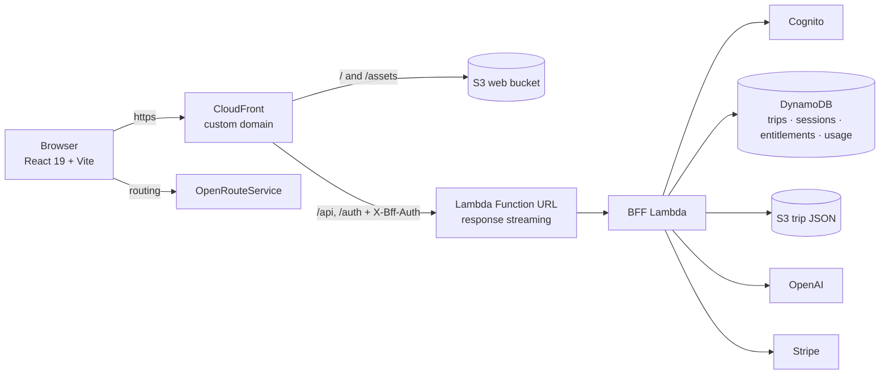

# Odyssey

**AI road-trip planner.** Describe the trip you want in a sentence, and Odyssey streams a day-by-day itinerary with a drawn route, stops, lodging and things to book, then lets you edit it and regenerate parts. Live at [findmyodyssey.com](https://findmyodyssey.com).

This is the whole product: `frontend/` is the React app, `infra/` is the AWS CDK stack and the Lambda backend.

## Features

- Free-text trip description turned into a structured, multi-day plan (OpenAI structured output, streamed as NDJSON so the itinerary fills in as it is generated)
- Route map with real road routing and drive times (Leaflet + OpenRouteService)
- Edit a trip and regenerate only the parts that changed, with optimistic locking on versions
- Accounts with email verification and password reset (Cognito), sessions kept server-side behind an HttpOnly cookie
- Free and Pro plans with Stripe Checkout, webhooks and a weekly AI-request quota
- Mobile-first UI, fully typed, with React Testing Library coverage per component

## Architecture



One CloudFront distribution serves the SPA and fronts the API, so auth is a first-party HttpOnly cookie and there is no CORS in production. The Function URL has to be public to stream, so CloudFront attaches a shared secret header on every origin request and the Lambda rejects anything without it.

## Tech stack

| Layer | |
|---|---|
| Frontend | React 19, TypeScript, Vite, Tailwind CSS v4, TanStack Query, React Hook Form + Zod, React Router, Leaflet, Vitest + Testing Library, Playwright |
| Backend | Node 20 Lambda (single BFF), OpenAI SDK, Stripe SDK, `aws-jwt-verify` |
| Infra | AWS CDK v2: CloudFront, S3, Lambda Function URL, Cognito, DynamoDB, SSM, Route 53, ACM |

## Notable engineering

- **Streaming structured output.** The Lambda streams OpenAI's JSON-schema-constrained response and emits NDJSON events (`status`, `metadata`, `place`, `leg`, `day`, `trip`) that the client folds into the trip as they arrive: `frontend/src/features/trips/data/useCreateTripStream.ts`, `infra/lambda/api.ts`.
- **Cookie sessions over Cognito.** Tokens never reach the browser. Sign-in stores them in a TTL'd DynamoDB sessions table; every request resolves the cookie to a verified Cognito `sub`. CSRF tokens protect mutations.
- **Plan enforcement.** Plan limits live in a small policy module on each side: the client uses them for form limits and messaging, the Lambda enforces them (trip length, activities per day, driving caps and the weekly AI quota).

## Running locally

```bash
cd frontend
cp .env.example .env          # ORS key, dev-proxy target, cookie domain, edge secret
npm ci
npm run dev                   # http://localhost:3001, /api and /auth proxied to a deployed backend
npm test                      # vitest
cp .env.e2e.example .env.e2e && npm run e2e   # Playwright login + smoke (needs a test user)
```

The dev server proxies `/api` and `/auth` to a deployed backend and rewrites the session cookie to `localhost`, so you can develop the frontend against real infrastructure without running the Lambda locally.

## Deploying

See [`infra/README.md`](infra/README.md). In short: an AWS profile, a hosted zone and an ACM certificate, `cp .env.example .env`, three one-time `setup-*-ssm.sh` scripts for the secrets, then `./deploy.sh`. `./deploy-frontend.sh` pushes a frontend build in about 30 seconds.

## Status and limitations

Odyssey is a working, deployed side project. Things I would change with more time: split the single-file Lambda into route modules, move OpenRouteService calls behind the BFF so the key is not in the browser bundle, and switch storage removal policies to `RETAIN`.

## License

MIT. See [LICENSE](LICENSE).
